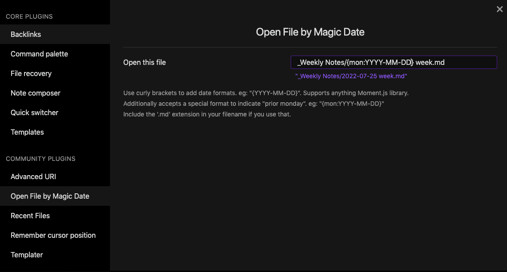

# Obsidian - Open File by Magic Date

Plugin for [Obsidian](https://obsidian.md)

## Summary

Lets you open a specific file that matches a flexible date pattern.

I use this to open the note which the date of the "most recent monday", but you could use it for any datestamped file.



## Use Cases

- [x] open a file with a specific date pattern like `{YYYY-MM-DD} foo.md` with a single keypress
- [x] Support specifying "the most recent monday" in these patterns for the weekly note use case. eg: `weekly notes/{mon: YYYY-MM-DD} week.md` with a single keypress
- [ ] Support specifying a search query, then open the first file that matches the query

## Installing

1. Open settings -> Third party plugin -> Disable Safe mode
1. Click "Browse community plugins" -> Search for "Magic File Hotkey"
1. Install it, then click "enable"

## Technical Details

The key piece of code is here, where the input file pattern is parsed by `moment.js` either against today's date or a different one:

```js
// send anything in curlies "{mon:...}" to moment.format for the preceeding monday
// eg: `Weekly Notes/{mon:YYYY-MM-DD} week.md`
str = str.replace(/{mon:(.*)}/g, (match, captured) => priorMonday.format(captured));

// send anything in curlies "{...}" to moment.format
// eg: `Daily Notes/{YYYY-MM-DD}.md`
str = str.replace(/{(.*)}/g, (_match, captured) => now.format(captured));
```

## Developing

### Building

```
# npm install
npm run dev
```

(for auto refreshing) install `git clone https://github.com/pjeby/hot-reload.git` and turn it on

### TODOs

- [ ] Support multiple files, different hotkeys for each
- [ ] handle removing a file, and then removing the associated command
- [x] Fix: the hotkey does not rename correctly when you edit the path (requires Obsidian restart)
- [x] Fix: the hotkey does not stick around correctly when you edit the path (requires choosing a hotkey again after restart)
- [x] Detect when the file exists, to help people check their syntax easily. ([example implementation](https://github.com/SilentVoid13/Templater/commit/e4273b706465df012648b8a0163018f4925b5808) of file.exists from the templater plugin)


### Releasing

1. Update the version in `package.json` (only)
2. `npm run version`

> This will trigger `.github/workflows/release.yml`.
> 
> verify the workflow is running [here](https://github.com/SimplGy/obsidian-open-file-by-magic-date/actions).
> Verify [releases here](https://github.com/SimplGy/obsidian-open-file-by-magic-date/releases)

4. (you're done) simply doing a github release and running release.yml will make the new version of the plugin available on the Obsidian marketplace. Nice!

## Thanks and credit

Originally forked and learned from [Hotkeys for specific files](https://github.com/Vinzent03/obsidian-hotkeys-for-specific-files). Thank you, [Vinzent03](https://github.com/Vinzent03).

## Similar Plugins

* [Homepage](https://github.com/mirnovov/obsidian-homepage) - open a specific note on startup
* [Hotkeys for starred files](https://github.com/Vinzent03/obsidian-shortcuts-for-starred-files)
* [Hotkeys for specific files](https://github.com/Vinzent03/obsidian-hotkeys-for-specific-files)