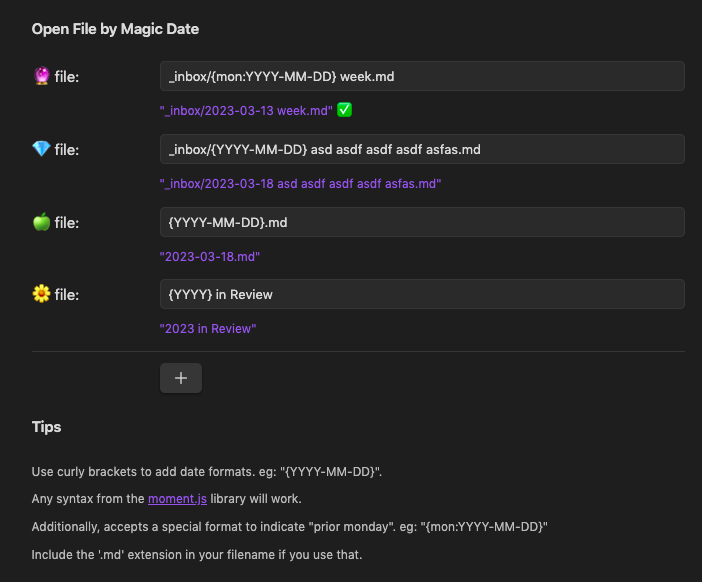

# Obsidian - Open File by Magic Date

Plugin for [Obsidian](https://obsidian.md)

## Summary

Lets you open a specific file that matches a flexible date pattern.

I use this to open the note which the date of the "most recent monday", but you could use it for any datestamped file.



## Use Cases

- [x] open a file with a specific date pattern like `{YYYY-MM-DD} foo.md` with a single keypress
- [x] Support specifying "the most recent monday" in these patterns for the weekly note use case. eg: `weekly notes/{mon: YYYY-MM-DD} week.md` with a single keypress
- [ ] Support specifying a search query, then open the first file that matches the query

## Installing

1. Open settings -> Third party plugin -> Disable Safe mode
1. Click "Browse community plugins" -> Search for "Magic File Hotkey"
1. Install it, then click "enable"

## Technical Details

The key piece of code is here, where the input file pattern is parsed by `moment.js` either against today's date or a different one:

```js
// send anything in curlies "{mon:...}" to moment.format for the preceeding monday
// eg: `Weekly Notes/{mon:YYYY-MM-DD} week.md`
str = str.replace(/{mon:(.*)}/g, (match, captured) => priorMonday.format(captured));

// send anything in curlies "{...}" to moment.format
// eg: `Daily Notes/{YYYY-MM-DD}.md`
str = str.replace(/{(.*)}/g, (_match, captured) => now.format(captured));
```

## Developing

### Building

```
npm install
npm run dev
```

1. install `git clone https://github.com/pjeby/hot-reload.git` for a nicer time.
2. turn it on, restart obsidian

### Releasing

1. Update version in `manifest.json` and `package.json`
2. commit, push.
3. finally, do this tag stuff to trigger `.github/workflows/release.yml`:

(replace with the new version number)

```
git tag -a 0.0.4 -m "0.0.4"
git push origin 0.0.4
```

> verify the workflow is running [here](https://github.com/SimplGy/obsidian-open-file-by-magic-date/actions). Verify [releases here](https://github.com/SimplGy/obsidian-open-file-by-magic-date/releases)

## Thanks and credit

Originally forked and learned from [Hotkeys for specific files](https://github.com/Vinzent03/obsidian-hotkeys-for-specific-files). Thank you, [Vinzent03](https://github.com/Vinzent03).

## Similar Plugins

* [Homepage](https://github.com/mirnovov/obsidian-homepage) - open a specific note on startup
* [Hotkeys for starred files](https://github.com/Vinzent03/obsidian-shortcuts-for-starred-files)
* [Hotkeys for specific files](https://github.com/Vinzent03/obsidian-hotkeys-for-specific-files)